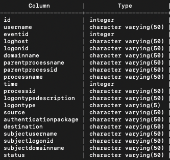
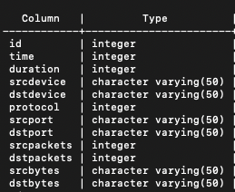

# COP5725Project

## Project Description 
- This is a modified implementation of the AIQL query system. The goal of this project is to allow for effective querying of APT behavior. This project accepts multievent, dependency, and anomaly queries, in the form of AIQL queries, and converts them into SQL queries. These queries are scheduled based on their respective pruning power, and executed on the PostgreSQL database with help from the psycopg Python library. The resulting host/network logs are clearly presented in a table for easy analysis.
- This project is based on the following paper, published at the 2018 USENIX Annual Technical Conference: https://www.usenix.org/system/files/conference/atc18/atc18-gao.pdf

## Dependencies
This project requires several Python libraries in order to function properly. These libraries include:
- psycopg2 (version 2.8.6)
- nltk (version 3.5)
- prettytable (version 2.1.0)
- antlr4 (version 4.9.2)

<em> Note: nltk will require the punkt download. This can be accomplished by spawning a python3 terminal, and entering $import nltk $nltk.download('punkt') </em>

## Included Files
- queryengine.py
	- This is the main project file. This file contains all of the logic to take advantage of ANTLR4's parser, lexer, and listener to analyze AIQL queries and convert them to SQL queries. 
	These queries are then sent to the PostgreSQL database running on the system, using the psycopg library.
- aiql.g4
	- This is our grammar developed for use with ANTLR4. This grammar accepts multievent, dependency, and anomaly queries, as defined in the originally published AIQL paper. Examples of these queries can be found at the bottom of this README.
- The following files are generated as a result of running ANTLR4 on our grammar file, aiql.g4:
	- aiqlLexer.py
		- The lexer is a recognizer that draws input symbols from a character stream. [https://www.antlr.org/api/Java/org/antlr/v4/runtime/Lexer.html]
	- aiqlParser.py
		- The parser recognizes contextual orderings of tokens, as dictated by the parsing rules in the grammar.
	- aiqlListener.py
		- This is a base listener class that we inherit from in our custom Listener class, extendedListener, which is defined within the queryengine.py file.
	- \*.interp
		- The files with the .interp extension are used by IDEs for debugging grammars. These are not necessary for our program.
	- \*.tokens
		- The files with the .tokens extension contain lists of token names and their numeric assignment, which is generated by ANTLR. These files are used by the lexer.
- 250linesHost.csv
	- This is a subset of the network logs used for testing our implementation of this project.
- 250linesNetwork.csv
	- This is a subset of the network logs used for testing our implementation of this project.

## Datasets
- For this project, we took advantage of the open source datasets provided by Los Alamos National Laboratory. Specifically, we used the Unified Host and Network Data Set. This dataset is a subset of network and computer events collected from within the LANL enterprise system over the course of 90 days.
- Host Data
	- The host dataset includes logs collected from Windows machines from within the enterprise network. These logs include the following possible Event IDs: 4768, 4769, 4770, 4774, 4776, 4624, 4625, 4634, 4647, 4648, 4672, 4800, 4801, 4802, 4803, 4688, 4689, 4608, 4609, 1100. 
	- Records will consist of the following possible attributes per event: Time, EventID, LogHost, LogonType, LogonTypeDescription, UserName, DomainName, LogonID, SubjectUserName, SubjectDomainName, SubjectLogonID, Status, Source, ServiceName, Destination, AuthenticationPackage, FailureReason, ProcessName, ProcessID, ParentProcessName, ParentProcessID. The attributes present in each record depends on the EventID.

- Network Data
	- The network events represent bi-directional events when possible. They are in the form of: {Time, Duration, SrcDevice, DstDevice, Protocol, SrcPort, DstPort, SrcPackets, DstPackets, SrcBytes, DstBytes}.

## PostgreSQL Database
- We have one single database, projectdb, which contains two relations. The first relation, hostlogs, contains our host event logs. The screenshot below shows the columns and their respective types in this relation.    
The second relation, netlogs, contains our sample network event logs. The screenshot below shows the columns and their repsective types in this relation.  <\br> 
